# [?? Live Status](https://Rf144.github.io/upptime): <!--live status--> **🟩 All systems operational**

## 📖 10 秒讀懂這頁

- 這是 **Vantage Automation 的服務監控儀**：機器人每 5 分鐘從外部巡邏一次所有服務，全自動記錄。
- 判讀：🟩 **Up ＝正常**；🟥 **Down ＝該次巡邏連不上**（若可用時間 % 仍高＝多為瞬斷或報表殘影，幾輪內自動校正；持續紅＋有 open issue 才是真故障）。
- 👉 **好讀版狀態頁：[rf144.github.io/upptime](https://rf144.github.io/upptime/)**（同一份資料的漂亮介面）
- 非公開系統以**代號**顯示（客戶系統 A、基礎設施 G…），屬刻意設計；出狀況時系統會自動開 Issue 並寄信通知維運者，平常**不需要人工看這頁**。

---

This repository contains the open-source uptime monitor and status page for [Rf144](https://Rf144.github.io/upptime), powered by [Upptime](https://github.com/upptime/upptime).

With [Upptime](https://upptime.js.org), you can get your own unlimited and free uptime monitor and status page, powered entirely by a GitHub repository. We use [Issues](https://github.com/Rf144/upptime/issues) as incident reports, [Actions](https://github.com/Rf144/upptime/actions) as uptime monitors, and [Pages](https://Rf144.github.io/upptime) for the status page.

<!--start: status pages-->
<!-- This summary is generated by Upptime (https://github.com/upptime/upptime) -->
<!-- Do not edit this manually, your changes will be overwritten -->
<!-- prettier-ignore -->
| URL | Status | History | Response Time | Uptime |
| --- | ------ | ------- | ------------- | ------ |
|  基礎設施 G | 🟩 Up | [g.yml](https://github.com/Rf144/upptime/commits/HEAD/history/g.yml) | 

 520ms
     
 | 

<a href="https://Rf144.github.io/upptime/history/g">100.00%</a>
    

|  客戶系統 A | 🟩 Up | [a.yml](https://github.com/Rf144/upptime/commits/HEAD/history/a.yml) | 

 172ms
     
 | 

<a href="https://Rf144.github.io/upptime/history/a">100.00%</a>
    

|  客戶系統 B | 🟩 Up | [b.yml](https://github.com/Rf144/upptime/commits/HEAD/history/b.yml) | 

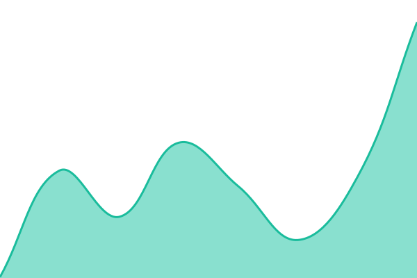 89ms
     
 | 

<a href="https://Rf144.github.io/upptime/history/b">100.00%</a>
    

|  客戶系統 C | 🟩 Up | [c.yml](https://github.com/Rf144/upptime/commits/HEAD/history/c.yml) | 

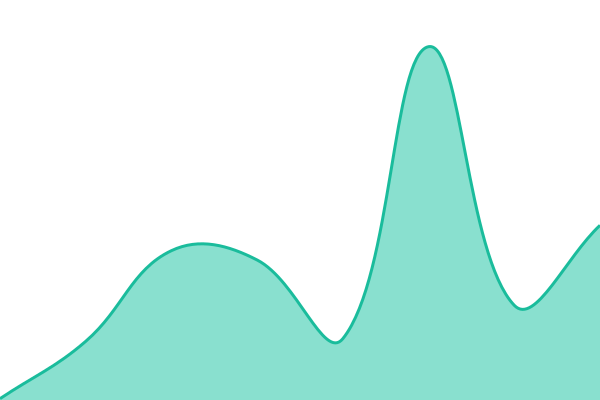 109ms
     
 | 

<a href="https://Rf144.github.io/upptime/history/c">100.00%</a>
    

|  產品系統 D | 🟩 Up | [d.yml](https://github.com/Rf144/upptime/commits/HEAD/history/d.yml) | 

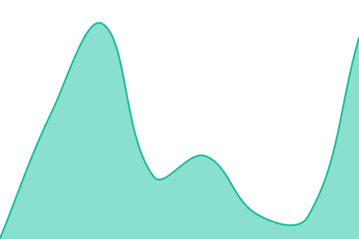 109ms
     
 | 

<a href="https://Rf144.github.io/upptime/history/d">100.00%</a>
    

|  內部工具 E | 🟩 Up | [e.yml](https://github.com/Rf144/upptime/commits/HEAD/history/e.yml) | 

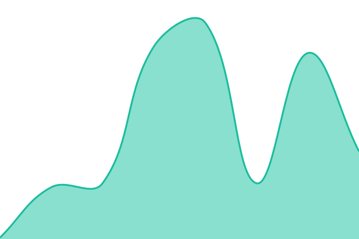 96ms
     
 | 

<a href="https://Rf144.github.io/upptime/history/e">100.00%</a>
    

|  內部工具 F | 🟩 Up | [f.yml](https://github.com/Rf144/upptime/commits/HEAD/history/f.yml) | 

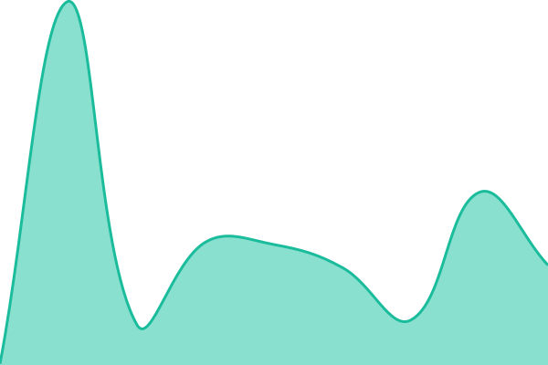 108ms
     
 | 

<a href="https://Rf144.github.io/upptime/history/f">100.00%</a>
    

|  主站 | 🟩 Up | [主站.yml](https://github.com/Rf144/upptime/commits/HEAD/history/主站.yml) | 

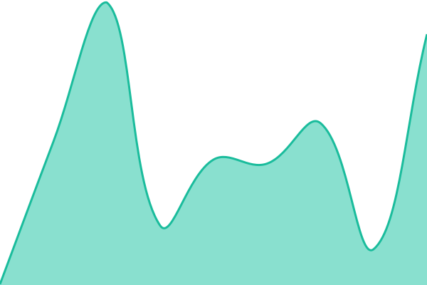 163ms
     
 | 

<a href="https://Rf144.github.io/upptime/history/主站">100.00%</a>
    

|  LINE Bot AI 客服 Demo | 🟩 Up | [line-bot-ai-demo.yml](https://github.com/Rf144/upptime/commits/HEAD/history/line-bot-ai-demo.yml) | 

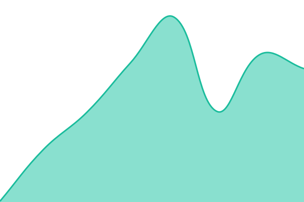 124ms
     
 | 

<a href="https://Rf144.github.io/upptime/history/line-bot-ai-demo">100.00%</a>
    

|  競品情報分析 | 🟩 Up | [競品情報分析.yml](https://github.com/Rf144/upptime/commits/HEAD/history/競品情報分析.yml) | 

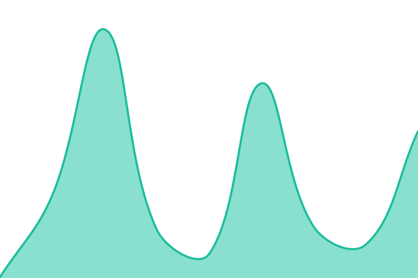 123ms
     
 | 

<a href="https://Rf144.github.io/upptime/history/競品情報分析">99.78%</a>
    

|  SmartContent 文案 | 🟩 Up | [smart-content.yml](https://github.com/Rf144/upptime/commits/HEAD/history/smart-content.yml) | 

 133ms
     
 | 

<a href="https://Rf144.github.io/upptime/history/smart-content">99.78%</a>
    

|  SmartERP | 🟩 Up | [smart-erp.yml](https://github.com/Rf144/upptime/commits/HEAD/history/smart-erp.yml) | 

 108ms
     
 | 

<a href="https://Rf144.github.io/upptime/history/smart-erp">99.79%</a>
    

|  HRM Pro | 🟩 Up | [hrm-pro.yml](https://github.com/Rf144/upptime/commits/HEAD/history/hrm-pro.yml) | 

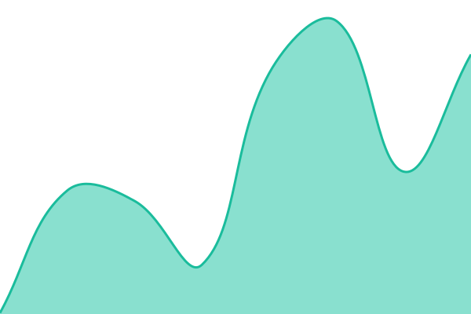 123ms
     
 | 

<a href="https://Rf144.github.io/upptime/history/hrm-pro">99.79%</a>
    

|  SmartSCM | 🟩 Up | [smart-scm.yml](https://github.com/Rf144/upptime/commits/HEAD/history/smart-scm.yml) | 

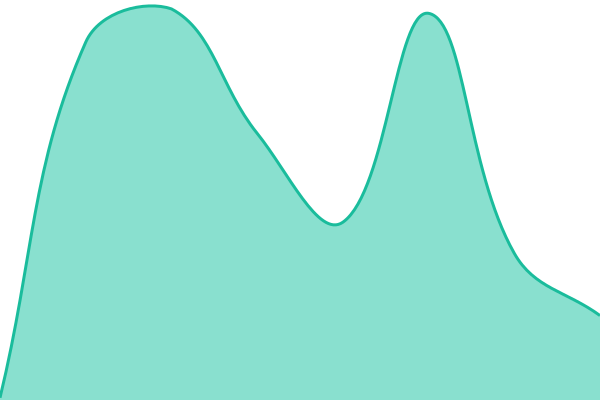 167ms
     
 | 

<a href="https://Rf144.github.io/upptime/history/smart-scm">99.80%</a>
    

|  SpacePro PMS | 🟩 Up | [space-pro-pms.yml](https://github.com/Rf144/upptime/commits/HEAD/history/space-pro-pms.yml) | 

 122ms
     
 | 

<a href="https://Rf144.github.io/upptime/history/space-pro-pms">99.80%</a>
    

|  AI 報價單 | 🟩 Up | [ai.yml](https://github.com/Rf144/upptime/commits/HEAD/history/ai.yml) | 

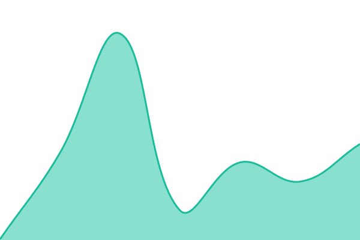 105ms
     
 | 

<a href="https://Rf144.github.io/upptime/history/ai">99.81%</a>
    

|  StyleShowcase | 🟩 Up | [style-showcase.yml](https://github.com/Rf144/upptime/commits/HEAD/history/style-showcase.yml) | 

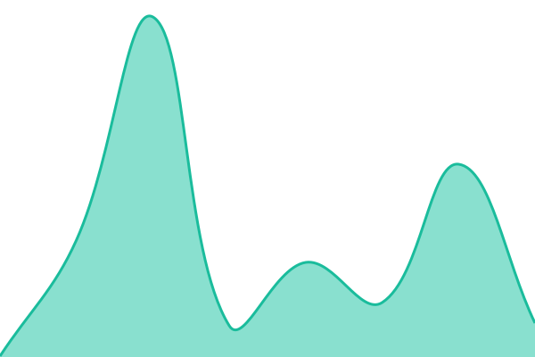 138ms
     
 | 

<a href="https://Rf144.github.io/upptime/history/style-showcase">99.82%</a>
    

|  SmartVisual | 🟩 Up | [smart-visual.yml](https://github.com/Rf144/upptime/commits/HEAD/history/smart-visual.yml) | 

 93ms
     
 | 

<a href="https://Rf144.github.io/upptime/history/smart-visual">99.82%</a>
    

|  FinSight | 🟩 Up | [fin-sight.yml](https://github.com/Rf144/upptime/commits/HEAD/history/fin-sight.yml) | 

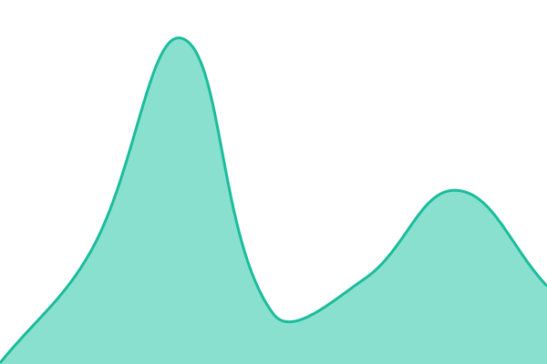 120ms
     
 | 

<a href="https://Rf144.github.io/upptime/history/fin-sight">99.83%</a>
    

|  StockSight | 🟩 Up | [stock-sight.yml](https://github.com/Rf144/upptime/commits/HEAD/history/stock-sight.yml) | 

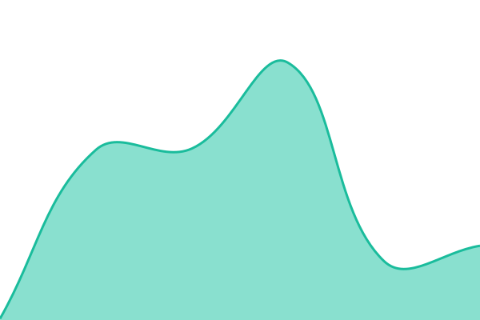 116ms
     
 | 

<a href="https://Rf144.github.io/upptime/history/stock-sight">99.83%</a>
    

|  UGC Video Tool | 🟩 Up | [ugc-video-tool.yml](https://github.com/Rf144/upptime/commits/HEAD/history/ugc-video-tool.yml) | 

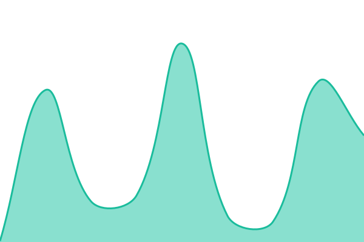 83ms
     
 | 

<a href="https://Rf144.github.io/upptime/history/ugc-video-tool">100.00%</a>
    

|  律師記帳士 | 🟩 Up | [律師記帳士.yml](https://github.com/Rf144/upptime/commits/HEAD/history/律師記帳士.yml) | 

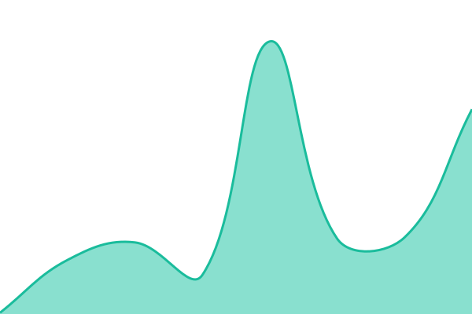 105ms
     
 | 

<a href="https://Rf144.github.io/upptime/history/律師記帳士">99.83%</a>
    

|  房仲 CRM | 🟩 Up | [crm.yml](https://github.com/Rf144/upptime/commits/HEAD/history/crm.yml) | 

 64ms
     
 | 

<a href="https://Rf144.github.io/upptime/history/crm">100.00%</a>
    

|  健身教練管理 | 🟩 Up | [健身教練管理.yml](https://github.com/Rf144/upptime/commits/HEAD/history/健身教練管理.yml) | 

 93ms
     
 | 

<a href="https://Rf144.github.io/upptime/history/健身教練管理">99.84%</a>
    

<!--end: status pages-->

[\*_Visit our status website ??_](https://Rf144.github.io/upptime)

## ?? License

- Powered by: [Upptime](https://github.com/upptime/upptime)
- Code: [MIT](./LICENSE) ??[Anand Chowdhary](https://anandchowdhary.com)
- Data in the `./history` directory: [Open Database License](https://opendatacommons.org/licenses/odbl/1-0/)
